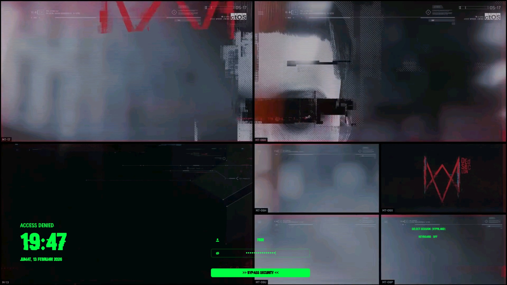

# SDDM DedSec Theme

A Watch Dogs 2 inspired SDDM theme with DedSec hacker aesthetic featuring matrix green colors and horizontal layout.



## Features

- 🎮 Watch Dogs 2 style horizontal layout
- 💚 Matrix green hacker color scheme
- 🎬 MP4/GIF video background support
- 🌐 Indonesian date/time localization
- ⚡ Qt6 compatible
- 🎨 Customizable fonts and colors

## Requirements

- SDDM (with Qt6 support)
- Qt6 Multimedia
- Qt5 Compat GraphicalEffects
- GStreamer plugins (for video/GIF support)

## Installation

### 1. Install Dependencies

```bash
sudo pacman -S qt6-multimedia qt5-graphicaleffects gst-plugins-base gst-plugins-good gst-plugins-bad gst-libav
```

### 2. Install Theme

```bash
# Clone or download this repository
git clone https://github.com/yourusername/sddm-dedsec-theme.git

# Copy theme to SDDM themes directory
sudo cp -r sddm-dedsec-theme /usr/share/sddm/themes/

# Set permissions
sudo chmod -R 755 /usr/share/sddm/themes/sddm-dedsec-theme
```

### 3. Configure SDDM

Edit SDDM configuration:

```bash
sudo nano /etc/sddm.conf
```

Set the theme:

```ini
[Theme]
Current=sddm-dedsec-theme
```

Or create a config file:

```bash
sudo mkdir -p /etc/sddm.conf.d/
sudo nano /etc/sddm.conf.d/theme.conf
```

Add:

```ini
[Theme]
Current=sddm-dedsec-theme
```

### 4. Apply Changes

```bash
sudo systemctl restart sddm
```

## Testing

Test the theme before applying (using Qt6):

```bash
sddm-greeter-qt6 --test-mode --theme /usr/share/sddm/themes/sddm-dedsec-theme/
```

## File Structure

```
/usr/share/sddm/themes/sddm-dedsec-theme/
├── Main.qml                    # Main theme file (Qt6)
├── Components/
│   ├── Clock.qml              # Clock component
│   ├── LoginForm.qml          # Login form layout (3-block horizontal)
│   ├── Input.qml              # Input fields
│   ├── SystemButtons.qml      # Shutdown/Reboot buttons
│   ├── SessionButton.qml      # Session selection
│   └── VirtualKeyboardButton.qml
├── Themes/
│   └── cyberpunk.conf         # Theme configuration
├── Backgrounds/
│   ├── dedsec.mp4             # Background video
│   ├── dedsec.gif             # Alternative GIF background
│   └── dedsec.jpg             # Static image fallback
└── README.md
```

## Customization

### Change Background

Edit `Themes/cyberpunk.conf`:

```ini
# For video (MP4)
Background="Backgrounds/your-video.mp4"

# For GIF
Background="Backgrounds/your-animation.gif"

# For static image
Background="Backgrounds/your-image.jpg"
```

Place your background file in the `Backgrounds/` folder.

### Change Font

1. Install your custom font:

```bash
# For system-wide (recommended for SDDM)
sudo mkdir -p /usr/share/fonts/custom
sudo cp your-font.ttf /usr/share/fonts/custom/
sudo fc-cache -fv
```

2. Check font name:

```bash
fc-list | grep "YourFont"
```

3. Edit `Themes/cyberpunk.conf`:

```ini
Font="Your Font Name"
FontSize="11"
```

### Change Colors

Edit `Themes/cyberpunk.conf` to customize colors:

```ini
# Main colors
HeaderTextColor="#00FF41"      # Matrix green
TimeTextColor="#00FF41"
DateTextColor="#00FF41"

# Form colors
LoginFieldBackgroundColor="#00000066"
PasswordFieldBackgroundColor="#00000066"
LoginFieldTextColor="#00FF41"
PasswordFieldTextColor="#00FF41"

# Button colors
LoginButtonTextColor="#000000"
LoginButtonBackgroundColor="#00FF41"
SystemButtonsIconsColor="#00FF41"

# Hover colors
HoverSystemButtonsIconsColor="#66FF66"
```

### Change Date/Time Format

Edit `Themes/cyberpunk.conf`:

```ini
# Locale
Locale="id_ID"              # Indonesian
# Locale="en_US"            # English

# Time format
HourFormat="HH:mm"          # 24-hour format
# HourFormat="hh:mm AP"     # 12-hour format

# Date format
DateFormat="dddd, d MMMM yyyy"  # Full: "Jumat, 13 Februari 2026"
# DateFormat="dd/MM/yyyy"       # Short: "13/02/2026"
```

### Layout Configuration

The theme uses a 3-block horizontal layout:

- **Left Block (28%)**: Clock and header
- **Center Block (35%)**: Login form (username, password, login button)
- **Right Block (25%)**: Session selection, system buttons, keyboard toggle

To adjust block sizes, edit `Components/LoginForm.qml`:

```qml
Layout.preferredWidth: parent.width * 0.28  // Left: 28%
Layout.preferredWidth: parent.width * 0.35  // Center: 35%
Layout.preferredWidth: parent.width * 0.25  // Right: 25%
```

## Troubleshooting

### Theme doesn't appear after reboot

1. Check SDDM logs:

```bash
journalctl -u sddm -b | tail -50
```

2. Verify theme is set:

```bash
cat /etc/sddm.conf | grep Current
```

3. Check if Qt6 is being used:

```bash
journalctl -u sddm -b | grep greeter
```

Look for `sddm-greeter-qt6` in the output.

### Video/GIF background not working

Install GStreamer plugins:

```bash
sudo pacman -S gst-plugins-base gst-plugins-good gst-plugins-bad gst-libav
```

Or use a static image as fallback:

```bash
# Extract frame from video
ffmpeg -i video.mp4 -vframes 1 -vf "scale=1920:1080" background.jpg

# Update config
Background="Backgrounds/background.jpg"
```

### Qt5 vs Qt6

This theme is designed for **Qt6** (`sddm-greeter-qt6`). If your system uses Qt5 (`sddm-greeter`), you'll need to:

1. Check which version you have:

```bash
journalctl -u sddm -b | grep greeter
```

2. If using Qt5, install Qt6 version:

```bash
sudo pacman -S sddm-git  # or rebuild SDDM with Qt6
```

### Fonts not appearing

1. Verify font is installed:

```bash
fc-list | grep "YourFont"
```

2. Make sure font is in system directory (not user directory):

```bash
ls /usr/share/fonts/
```

3. Rebuild font cache:

```bash
sudo fc-cache -fv
```

## Credits

- Original theme: [sddm-astronaut-theme](https://github.com/Keyitdev/sddm-astronaut-theme) by Keyitdev
- Inspired by: Watch Dogs 2 DedSec aesthetic
- Modified for: DedSec hacker theme with horizontal layout

## License

Distributed under the GPLv3+ License. See LICENSE for more information.

## Support

If you encounter issues:

1. Check the Troubleshooting section above
2. Review SDDM logs: `journalctl -u sddm -b`
3. Test with: `sddm-greeter-qt6 --test-mode --theme /usr/share/sddm/themes/sddm-dedsec-theme/`
4. Open an issue on GitHub

---

Made with 💚 for the DedSec community
